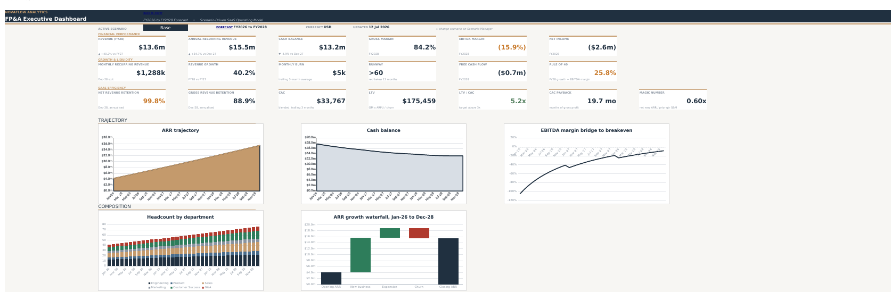
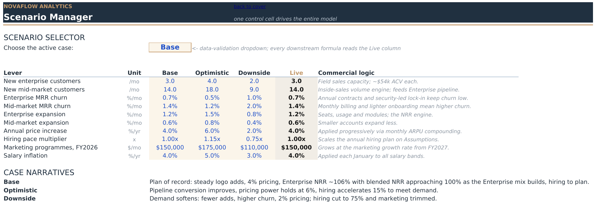
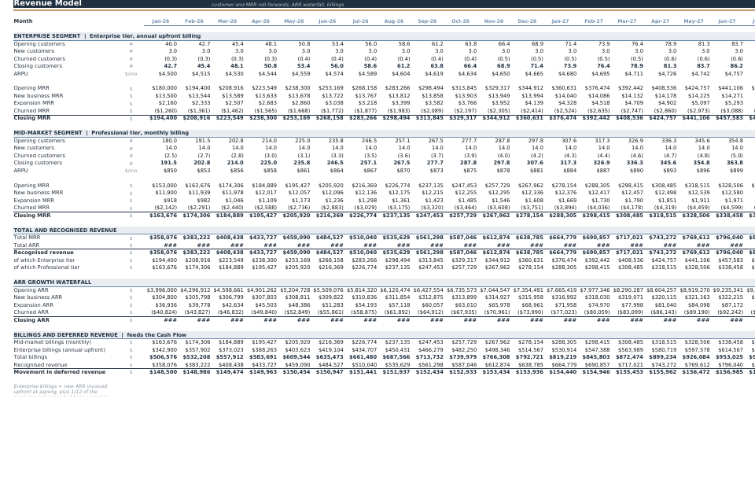

# NovaFlow Analytics: Three-Year SaaS FP&A Model (V1)

A fully formula-driven, scenario-controlled operating model for a fictional B2B SaaS company, built to portfolio standard. 36-month engine (Jan-2026 to Dec-2028), 10 sheets, ~5,200 formulas, zero hardcodes outside designated input cells.



At a glance: one dropdown flips the entire model across Base / Optimistic / Downside, and a colour-coded chip plus status bar keep the active scenario, forecast period and refresh context visible at all times. The dashboard above recalculates live from the calculation spine below it: revenue and MRR roll-forwards, a formula-driven headcount and payroll build, a monthly P&L with NOL-adjusted tax, and an indirect cash flow with runway. No circular references, no hardcoded outputs.

> **Disclaimer:** This project was built for portfolio purposes. NovaFlow Analytics is a fictional company, and all assumptions and financial figures are illustrative. Nothing here is financial advice.

## Tech stack

- **Microsoft Excel (2021 / Microsoft 365)** as the modelling engine
- **Dynamic array and lookup functions** (XLOOKUP, IFERROR, TEXT) for a spill-free, auditable build
- **Named ranges** to propagate the scenario switch across sheets
- **Data validation** for the single scenario control cell
- **Conditional formatting** for the colour-coded scenario chip and traffic-light KPIs
- **Native Excel charts** styled to a consistent brand palette

Techniques: driver-based forecasting, scenario analysis, SaaS revenue recognition (billings vs recognised vs deferred), roll-forward schedules, NOL carryforward, and a self-checking tie-out panel.

## The business

NovaFlow Analytics sells workflow-analytics subscriptions to operations and finance teams running high-volume digital processes. Two tiers map to two segments: **Professional** (mid-market, ~$850/mo, billed monthly, inside-sales motion, higher churn) and **Enterprise** (~$4,500/mo, billed annually upfront, field-led, lower churn, expansion-driven). The plan takes ARR from ~$4m to ~$15m while EBITDA margin improves from roughly -65% to the high minus-teens, funded by an $18m Series B. Enterprise NRR runs ~106%; blended NRR approaches 100% as the Enterprise mix builds.

## Architecture

One-directional dependency spine, no circular references:

```
Scenario Manager -> Assumptions -> Revenue | Headcount | OpEx
                 -> Income Statement -> Cash Flow -> KPI Dashboard
```

- **Scenario Manager**: 10 levers x Base/Optimistic/Downside. One data-validated control cell drives a Live column via INDEX/MATCH; everything downstream reads the Live column through named ranges. Flip the dropdown and the whole model recalculates.
- **Revenue Model**: customer and MRR roll-forwards per segment (opening + new + expansion - churn), ARPU compounding at the scenario price increase, ARR growth waterfall, and a billings vs recognised-revenue split. Enterprise bills new ARR upfront and renews 1/12 of the surviving base each month; the resulting deferred revenue movement feeds the Cash Flow. This is the SaaS-specific mechanism that separates cash from P&L.
- **Headcount**: annual hiring plan by department (inputs on Assumptions), scaled by the scenario hiring pace, with salary inflation applied each January and a fully loaded factor (bonus, benefits, payroll taxes). Feeds OpEx payroll entirely by formula.
- **Operating Expenses**: COGS (hosting % of revenue + support share of Customer Success), S&M, R&D, G&A, plus a capex placeholder and straight-line depreciation that V2 replaces.
- **Income Statement**: monthly P&L with FY2026-FY2028 rollups and an NOL carryforward (tax charged only on cumulative positive pre-tax income).
- **Cash Flow**: indirect method (NI + D&A + deferred revenue movement - capex), cash roll-forward, trailing three-month burn and guarded runway. Labelled placeholder lines mean V2 working capital and financing slot in without rework.
- **KPI Dashboard**: an executive one-pager organised into three bands (Financial Performance, Growth & Liquidity, SaaS Efficiency) behind a status bar and a colour-coded scenario chip. Headline cards cover revenue, ARR, cash, gross and EBITDA margin, net income, MRR, revenue growth, burn, runway and Rule of 40; the efficiency band covers NRR, GRR, CAC, LTV, LTV/CAC, CAC payback and Magic Number. Five brand-styled charts (ARR trajectory, cash balance, EBITDA-margin bridge, headcount by department, ARR growth waterfall) and traffic-light conditional formatting sit beneath the cards.

## A look inside

**Scenario Manager** drives the entire model from one control cell. Ten levers are defined for Base, Optimistic and Downside; a data-validated dropdown selects the case, and a Live column (read by every downstream sheet through named ranges) resolves the active values.



**Revenue Model** runs customer and MRR roll-forwards per segment (opening + new + expansion - churn), then splits billings from recognised revenue and tracks the deferred-revenue movement that feeds the Cash Flow. This is the SaaS-specific mechanism that separates cash from P&L.



## Conventions

Blue font on cream fill = hardcoded input. Black = formula. Green = cross-sheet link. Lookups use XLOOKUP (single-cell, non-spilling; the 2D headcount lookup nests two XLOOKUPs). MATCH appears only as a membership test in the checks panel. Negatives in parentheses, zeros as dashes. A six-line checks panel on Instructions must read all OK (scenario validity, revenue tie-out, payroll tie-out, cash tie-out, ARR waterfall tie-out, tax sign).

## Verification

The calculation engine was recalculated under all three scenarios with zero formula errors (~5,200 formulas) using an INDEX/MATCH-equivalent build; the shipped XLOOKUP formulas are a like-for-like syntax swap carrying the verified cached values, and recalculate on open in Excel (2021 or 365 required for XLOOKUP). Five formulas hand-verified against independent calculations (customer roll-forward, MRR roll-forward, billings, payroll load, depreciation). Headline outputs sense-checked: FY28 revenue $13.6m (+40%), gross margin ~84%, FY28 EBITDA margin -16% (Optimistic turns positive at +5%), CAC payback ~20 months, LTV/CAC ~5x, runway comfortable in all cases (25 months at trough in Downside).

## Roadmap

**V1 (this file)**: 10 sheets as above. **V2**: Balance Sheet, full working capital (DSO/DPO, deferred revenue balance), capex and fixed asset schedule, debt schedule and financing. The calculation spine and placeholder rows were designed so these bolt on without rework.

Fonts: Aptos Display / Aptos / Aptos Narrow / Bahnschrift SemiBold, with Arial fallbacks noted on the Instructions sheet. All figures are illustrative.

## How to use

Open `NovaFlow_Analytics_FPA_Model_v1.xlsx` in **Excel 2021 or Microsoft 365** (XLOOKUP is required; older versions and most alternative spreadsheet apps will not recalculate correctly). Start on the **Instructions** sheet for the reading guide, colour legend, and checks panel. To run a scenario, go to **Scenario Manager**, change the single control cell to Base / Optimistic / Downside, and the whole model recalculates. Blue-on-cream cells are the only inputs meant to be edited.

## Key features

- **Single-switch scenario engine.** Ten levers across Base / Optimistic / Downside, one data-validated control cell, propagated through named ranges with no circular references.
- **SaaS-correct revenue mechanics.** Per-segment customer and MRR roll-forwards, ARPU compounding, and an explicit billings / recognised-revenue / deferred-revenue split, so cash and P&L diverge the way they do in a real annual-billing SaaS.
- **Driver-based headcount and payroll.** A departmental hiring plan scaled by scenario pace, January salary inflation, and a fully loaded cost factor, feeding OpEx entirely by formula.
- **NOL-aware tax and guarded runway.** Tax charged only on cumulative positive pre-tax income; runway floored and flagged when it falls below the threshold.
- **Executive dashboard.** A three-band KPI hierarchy, colour-coded scenario chip, status bar, five brand-styled charts, and traffic-light conditional formatting on the metrics that matter.
- **Self-checking.** A six-line tie-out panel (scenario validity, revenue, payroll, cash, ARR waterfall, tax sign) that must read all OK before the model is trusted.

## Key assumptions

All assumptions live in blue-on-cream input cells on the Assumptions and Scenario Manager sheets and can be changed without touching a formula. The Professional tier is priced around $850/mo billed monthly with higher churn; Enterprise is around $4,500/mo billed annually upfront with NRR near 106%. New-logo adds ramp steadily, ARPU compounds at roughly 4%/yr, and hiring follows a departmental plan with salary inflation applied each January. The plan is funded by an $18m Series B, and tax applies only once cumulative pre-tax income turns positive. All figures are illustrative.

## What this demonstrates

An end-to-end SaaS operating model built the way a lender or investor would expect to receive it: a one-directional dependency spine with no circular references, a single scenario switch driving every downstream sheet through named ranges, SaaS-correct separation of billings, recognised revenue and deferred revenue, and a self-checking tie-out panel. It is intended as a portfolio piece showing FP&A modelling, Excel engineering, and SaaS metric fluency (NRR, GRR, CAC, LTV, CAC payback, Magic Number, Rule of 40).

## What I learned

Building this end to end sharpened a few things. Separating billings from recognised revenue from deferred revenue is where SaaS models earn their keep: getting the Enterprise annual-upfront mechanic right is what makes cash and P&L tell different, and correct, stories. Enforcing a one-directional dependency spine up front, rather than patching circular references later, kept the model auditable and made the scenario switch trivial to wire through named ranges. A self-checking tie-out panel turned "I think it balances" into "it reads OK or it doesn't", which is the difference between a spreadsheet and a model I would hand to an investor. If I were starting over, I would build the Balance Sheet and working-capital schedule from day one rather than leaving them to V2.

## License

Released under the [MIT License](LICENSE). All figures are illustrative and for a fictional company; nothing here is financial advice.

## Author

**Soban Farid**, Chartered Accountant (ICAP) with experience in audit, financial reporting, and financial modelling. This project was built to deepen expertise in FP&A and driver-based planning. Feedback and questions welcome via GitHub issues.

## Version history

**v1.0** (current)

- Initial public release
- Driver-based, scenario-controlled SaaS operating model (36-month engine, 10 sheets)
- Executive KPI dashboard with three-band hierarchy, scenario chip and five charts
- Self-checking tie-out panel

**v2.0** (planned)

- Balance Sheet and full working-capital schedule (DSO / DPO, deferred-revenue balance)
- Capex and fixed-asset schedule, debt schedule and financing
